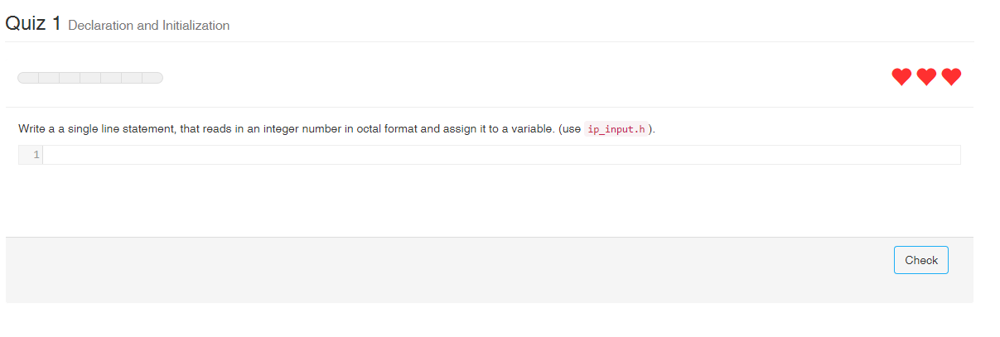

duoquiz - Javascript Library
=======
## Introduction
Here we want to introduce duoquiz – a JavaScript library to embed a quiz that provides besides multiple choice and true-false questions a special type of Parson’s puzzles that focus on simple statements (mainly on a single-line). In addition, duoquiz introduces code fragment questions that require the learners to type in the answer as code. Currently, only the **C** programming language is supported.

The goal of the quiz is to provide a simple tool for fostering the programming language proficiency with questions that require the user to write, create and read small statements and expressions.



See http://waywaaard.github.io/duoquiz/ for a demo.

The quiz uses a C Lexer and Parser that is generated with [zaach/jison](https://github.com/zaach/jison/). You can find all Lexer and Parser specific file under ```compiler/c```

## Quiz
The current demo uses the implementation found under ```/quiz```. It uses ```require.js```, [Khan/KaTeX](https://github.com/Khan/KaTeX/) and [twbs/bootstrap](https://github.com/twbs/bootstrap/).

A completely new implementation that is intended to support the Python language can be found under ```duopy/```. However, it is work in progress and cannot be used at the moment. The reimplementation uses ES6 features like classes, ```babel.js``` for transpiling, ```browserify``` and ```gulp``` for building.

## Javascript C Lexer and Parser
The following project provides a lexer and parser for checking given C input syntactically and grammatically.
* Lexer for C11 Standard
* Lexes and parses preprocessor statements
* Preprocessor does not parse constant-expressions like stated in the standard
* Prints out debug messages with the currently matched rule

Dependencies:
* Lexer and Parser are generated by jison
* returns a AST of the parsed input
* use ```Makefile``` to create AMD js

### Building the Lexer and Parser
**ToDo**

Currently using a makefile and nodejs.

### Parser
Additional information about writing a parser for bison/jison can be found here:
* http://www.gnu.org/software/bison/manual/html_node/Action-Types.html#Action-Types
* http://books.google.de/books?id=3Sr1V5J9_qMC&pg=PA148&lpg=PA148&dq=bison+what+is+$$%5B$0-1%5D&source=bl&ots=WFEyeaiMKT&sig=QMHeuzyF1g0q0Ijg3tlIRKrpX9Y&hl=de&sa=X&ei=ziHvU-r3E9Cp7AbAh4GIBg&ved=0CCMQ6AEwAA#v=onepage&q=%24%24%5B%240-1%5D&f=false
* http://stackoverflow.com/questions/8467150/how-to-get-abstract-syntax-tree-ast-out-of-jison-parser
* http://tldp.org/HOWTO/Lex-YACC-HOWTO-6.html

#### EBNF
Jison supports now the parsing of the EBNF Grammar and therefor it would be possible to use the
c++0x-Standard from here http://www.nongnu.org/hcb/#header-name

More information about EBNF support can be found here: https://gist.github.com/zaach/1659274
